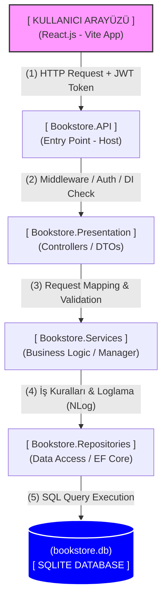

### 📚 Bookstore Management System (Full-Stack)
---
Bu proje, modern yazılım geliştirme prensipleri olan Katmanlı Mimari (Layered Architecture), Merkezi Hata Yönetimi, Yapılandırılmış Loglama (Structured Logging) ve Rol Tabanlı Erişim Kontrolü (RBAC) kullanılarak ASP.NET Core ve React ile geliştirilmiş kapsamlı bir Kitap Envanter Yönetim Sistemi'dir.

### 🎯 Projenin Amacı ve Kazanımlar
---
Bu proje, monolitik bir yapıyı modüler ve sürdürülebilir bir mimariye dönüştürme pratiği olarak tasarlanmıştır. Özellikle Dependency Injection, Entity Framework Core üzerinden ilişkisel veri yönetimi ve NLog ile custom log mekanizmaları üzerine yoğunlaşılmıştır.

## 🛠 Kullanılan Teknolojiler

### **Backend**
* **Framework:** .NET 10.0 (ASP.NET Core Web API)
* **Database:** SQLite (Hafif, taşınabilir ve hızlı geliştirme için)
* **ORM:** Entity Framework Core (Code-First Yaklaşımı)
* **Authentication:** JWT (JSON Web Token) ile Stateless Yetkilendirme
* **Logging:** NLog (Custom `ILoggingService` wrapper ile)
* **Mimari Desenler:** Layered Architecture, Repository Pattern, Service Manager (Facade/Unit of Work benzeri)

### **Frontend**
* **Kütüphane:** React.js (Vite ile optimize edilmiş)
* **State Yönetimi:** React Hooks (`useState`, `useEffect`)
* **Ağ İstekleri:** Fetch API (JWT Bearer Token entegrasyonu ile)

---

## 🏗 Proje Mimarisi (Layered Architecture)

### 📂 **Bookstore.Entities**
Veritabanı modellerinin (**Book**, **Category**) ve veri transfer nesnelerinin (**DTO**) bulunduğu, bağımlılıksız en alt katmandır.

### 📂 **Bookstore.Repositories**
Veritabanı işlemleri, **AppDbContext** ve **RepositoryManager** yapısının bulunduğu veri erişim katmanıdır.

### 📂 **Bookstore.Services**
İş kurallarının (**Business Logic**) işletildiği, loglama ve doğrulama işlemlerinin yapıldığı katmandır.

### 📂 **Bookstore.Presentation**
Sadece HTTP isteklerini karşılayan ve DTO'lar aracılığıyla servis katmanıyla konuşan **Controller** katmanıdır.

### 📂 **Bookstore.API**
Uygulamanın giriş noktasıdır (**Entry Point**). **IoC Container** kayıtları, Middleware sıralamaları ve **NLog** konfigürasyonlarını içerir.

### 🔄 Bookstore İstek ve Veri Akış Şeması
---
Aşağıdaki şema, bir istemcinin (Client) gönderdiği talebin katmanlar arasında nasıl ilerlediğini göstermektedir:




### 🚀 Kurulum ve Çalıştırma Adımları

Projeyi lokal ortamınızda çalıştırmak için aşağıdaki adımları izleyin:

Ön Gereksinimler
.NET 10.0 SDK
Node.js (v18+)
1. Backend'i Ayağa Kaldırma
Terminali açın ve Bookstore.API dizinine gidin:
cd Bookstore.API
Bağımlılıkları yükleyin:
 ```bash
dotnet restore
```
Projeyi çalıştırın:
```bash
dotnet run
```
Not: Uygulama ilk kez çalıştığında, DemoService devreye girerek bookstore.db SQLite veritabanını otomatik olarak oluşturur ve içine test kategorileri/kitapları (Seed Data) ekler. Ekstra bir migration komutu çalıştırmanıza gerek yoktur.

2. Frontend'i Ayağa Kaldırma

Yeni bir terminal penceresi açın ve Bookstore.Frontend dizinine gidin:
```bash
cd Bookstore.Frontend
```

NPM paketlerini yükleyin:
```bash
npm install
```
Geliştirme sunucusunu başlatın:
```bash
npm run dev
```
### 🔐 Kimlik Doğrulama ve Roller (RBAC)

Sistemde yetkilendirme işlemleri Controller seviyesinde korunmaktadır ve 3 farklı rol bulunmaktadır:

### Rol	Kullanıcı Adı	Şifre	Yetkiler
---
ADMIN		Sistemi "Golden State" (Demo) durumuna sıfırlama, tam erişim.

SELLER		Envantere yeni kitap (POST) ekleme yetkisi

BUYER		Sadece kitapları listeleme (GET) yetkisi.

### 💡 Önemli Teknik Kararlar ve Çözümler
---

### Loglama Yönetimi (NLog)
---
Loglar, konsol ve dosya olarak ikiye ayrılmıştır. Bookstore.API/logs dizini altında:

all-{date}.log: Tüm EF Core SQL sorguları ve sistem kayıtları.

bookstore-own-{date}.log: Sadece projenin kendi Service ve Controller katmanlarından fırlatılan özel iş mantığı logları tutulmaktadır.

### 👤 Geliştirici:
---
Hakan Tarık Karaduman

### 🎓 Üniversite:
---
Pamukkale Üniversitesi - Bilgisayar Mühendisliği (3. Sınıf)